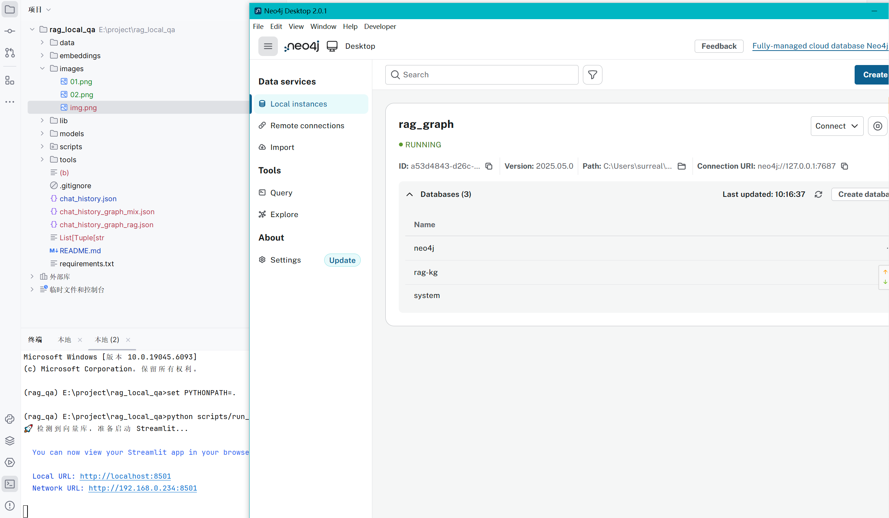
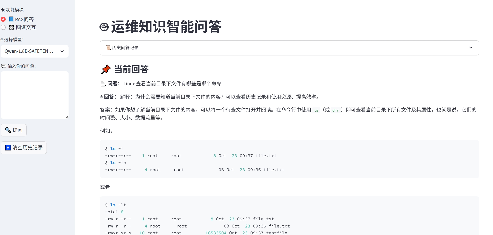
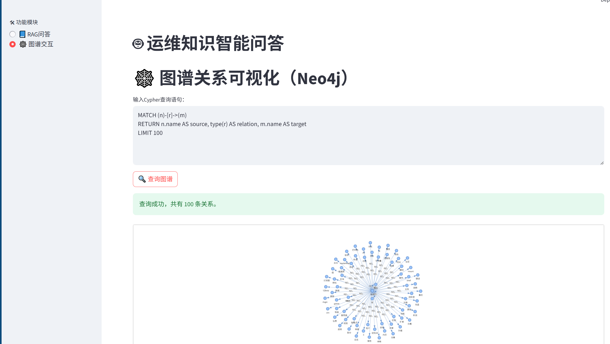

# 运维智能问答平台（RAG + 中文本地模型 + 知识图谱交互）

## 🧠 功能
- 多模型中文LLM问答（Qwen、GLM、llama、MiniCPM4）
- 中文向量化检索（BAAI/bge-large-zh）
- Word/PDF/Excel上传构建知识库
- Streamlit知识图谱交互界面

## 🧰 环境要求
- 需要安装(neo4j数据库)[https://neo4j.com] 开启本地数据库服务，配置如下，如果更改请将代码相关部分也一并修改。
```text
NEO4J_URI = "bolt://localhost:7687"
NEO4J_USER = "neo4j"
NEO4J_PASSWORD = "12345678"  # 请根据你的设置替换
```
- 在win10/nvidia geforce rtx3060laptop成功运行，如需迁移至linux系统，请注意修改目录路径的斜线

## 🚀 快速开始
```bash
# windows
cd \path\to\rag_local_qa  # 进入这个项目目录下，看你自己将软件目录放在哪里
set PYTHONPATH=.

# 安装依赖
pip install -r requirements.txt
python -m spacy download zh_core_web_sm

# 构建知识图谱
python scripts/build_graph_from_doc.py

# 构建向量库
python scripts/build_vector_store.py

# 启动问答界面
python scripts/run_web_ui.py
```

## 📦 模型下载建议（支持GGUF量化版和safetensors格式）
- Qwen: [Qwen1.5-1.8B](https://huggingface.co/Qwen/Qwen1.5-1.8B/tree/main)
- THUDM: [glm-edge-1.5b-chat](https://huggingface.co/THUDM/glm-edge-1.5b-chat/tree/main)
- openbmb: [MiniCPM4-0.5B](https://huggingface.co/openbmb/MiniCPM4-0.5B/tree/main)
- TinyLlama: [TinyLlama-1.1B-Chat-v1.0](https://huggingface.co/TinyLlama/TinyLlama-1.1B-Chat-v1.0/tree/main)
- [llama-2-7b.Q4_K_M](https://huggingface.co/TheBloke/Llama-2-7B-GGUF/tree/main)

✅ 下载后统一放置到 models/ 目录下对应子文件夹中。

## 📁 项目目录结构

```text
│  chat_history.json
│  chat_history_graph_mix.json
│  chat_history_graph_rag.json
│  List[Tuple[str
│  README.md
│  requirements.txt
│
├─.idea
│  │  .gitignore
│  │  deployment.xml
│  │  misc.xml
│  │  modules.xml
│  │  rag_local_qa.iml
│  │  vcs.xml
│  │  workspace.xml
│  │
│  └─inspectionProfiles
│          profiles_settings.xml
│          Project_Default.xml
│
├─data
│      *.pdf *.docx
│
├─embeddings
│  ├─faiss_store
│  │      index.faiss
│  │      index.pkl
│  │      record.json
│  │
│  └─graph_store
│          record.json
│
├─lib
│  ├─bindings
│  │      utils.js
│  │
│  ├─tom-select
│  │      tom-select.complete.min.js
│  │      tom-select.css
│  │
│  └─vis-9.1.2
│          vis-network.css
│          vis-network.min.js
│
├─models
│  ├─llama
│  │      llama-2-7b.Q4_K_M.gguf
│  │
│  ├─openbmb
│  │  └─MiniCPM4-0.5B
│  │          added_tokens.json
│  │          config.json
│  │          configuration_minicpm.py
│  │          generation_config.json
│  │          model.safetensors
│  │          modeling_minicpm.py
│  │          special_tokens_map.json
│  │          tokenizer.json
│  │          tokenizer.model
│  │          tokenizer_config.json
│  │
│  ├─Qwen
│  │  └─Qwen1.5-1.8B
│  │          config.json
│  │          generation_config.json
│  │          merges.txt
│  │          model.safetensors
│  │          tokenizer.json
│  │          tokenizer_config.json
│  │          vocab.json
│  │
│  ├─THUDM
│  │  └─glm-edge-1.5b-chat
│  │          config.json
│  │          generation_config.json
│  │          model.safetensors
│  │          special_tokens_map.json
│  │          tokenizer.json
│  │          tokenizer_config.json
│  │
│  └─TinyLlama
│      └─TinyLlama-1.1B-Chat-v1.0
│              config.json
│              eval_results.json
│              generation_config.json
│              model.safetensors
│              special_tokens_map.json
│              tokenizer.json
│              tokenizer.model
│              tokenizer_config.json
│
├─scripts
│  │  build_graph_from_doc.py
│  │  build_vector_store.py
│  │  neo4j_vis.py
│  │  query_rag_mixed.py
│  │  query_rag_with_graph.py
│  │  remove_doc.py
│  │  run_web_ui.py
│  │  __init__.py
│  │
│  └─__pycache__
│          neo4j_vis.cpython-310.pyc
│          __init__.cpython-310.pyc
│
└─tools
        read_gguf_header.py
        test_ctransformers.py
        test_cuda.py
        test_neo4j_running.py


```

## 🔍 实践
- ❗ Baichuan2-7B-Chat、Yi-1.5-6B-Chat在移动版3060爆显存
- ❌ MiniCPM-2B-sft-bf16、MiniCPM3-4B-GGUF简单调试后发现无法适配
- ⚙️ llama-2-7b.Q4_K_M模型推理如果设置"gpu_layers"参数的话，可能会导致回答效果降低
- ✅ 综合对比还是qwen效果好
- 实机测试如下：



